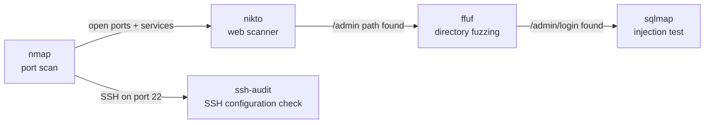

Cairn does not perform reconnaissance, scanning, or exploitation by itself. Instead, it delegates work to external programs — tools like `nmap`, `ffuf`, `sqlmap`, `curl`, and others — by invoking them with precisely constructed arguments and then interpreting their output. This model keeps Cairn's core focused on reasoning while leveraging the security community's existing, battle-tested toolset.

## What tool use means

In Cairn's architecture, a "tool" is any external executable, API, or script that the agent can call with a defined interface. Each tool is registered with:

- A **name** and **description** that the LLM uses to decide when to invoke it
- An **input schema** describing required and optional parameters
- An **output parser** that converts raw stdout, stderr, or HTTP responses into structured data the agent can reason about

<CardGroup cols={2}>
  <Card title="CLI programs" icon="terminal">
    Tools like `nmap`, `ffuf`, `nikto`, `sqlmap`, `gobuster`, and `curl` are wrapped as callable tools with schema-validated arguments.
  </Card>
  <Card title="APIs and services" icon="cloud">
    External services — vulnerability databases, WHOIS lookups, DNS resolvers — are exposed as tools with HTTP-based interfaces.
  </Card>
  <Card title="Custom scripts" icon="file-code">
    You can register your own scripts as tools. Cairn will invoke them the same way it invokes built-in tools, as long as they conform to the input/output schema.
  </Card>
  <Card title="Internal operations" icon="gear">
    Some tools are internal: file read/write, finding storage, and report generation are all modeled as tool calls so the agent uses a consistent interface for all actions.
  </Card>
</CardGroup>

## Tool selection

When the agent reaches a sub-task, it chooses which tool to invoke by reasoning over the available tool descriptions. The LLM reads the sub-task goal, the current context, and the tool registry, then produces a tool-call decision.

Selection is influenced by:

- **Relevance**: does the tool's description match what this sub-task needs?
- **Prior success**: tools that returned useful output earlier in the session are weighted slightly higher for similar tasks
- **Scope constraints**: tools that require capabilities outside the declared scope (e.g., active exploitation when only passive scanning is permitted) are excluded
- **Tool availability**: if a preferred tool is not installed, the agent falls back to an alternative from the same category

<Info>
  Cairn does not hard-code tool-to-phase mappings. The LLM selects tools dynamically, which means it can substitute tools when the preferred one is unavailable or use an unconventional tool if reasoning suggests it is the best fit.
</Info>

## Tool invocation

Once a tool is selected, the agent generates the argument set. This involves:

1. **Parameter generation**: the LLM fills in required and optional fields based on the sub-task context — target IP, port range, wordlist path, timeout value, and so on.
2. **Schema validation**: the generated arguments are checked against the tool's input schema before anything is executed. Invalid or dangerous values (e.g., a target outside the declared scope) are rejected at this stage.
3. **Execution**: the validated command is passed to the execution layer, which runs it in an isolated environment and captures stdout, stderr, and exit code.

```bash
# Example: nmap invocation generated by Cairn for a service-identification sub-task
nmap -sV -p 22,80,443,8080 --open -T4 --max-retries 2 192.168.1.10
```

<Note>
  Cairn always logs the exact command it executes, including all arguments. This makes the assessment fully auditable — you can reproduce any step manually if needed.
</Note>

## Parsing tool output

Raw tool output is rarely in a form the LLM can reason about directly. Each tool's output parser is responsible for converting raw text into a structured finding object. For example, nmap XML output is parsed into a list of host/port/service records; `sqlmap` output is parsed to extract confirmed injection points and database information.

Parsing handles:
- **Format detection**: XML, JSON, plain text, and mixed formats
- **Error extraction**: distinguishing between a clean run with no results and a run that failed due to network issues or misconfiguration
- **Confidence scoring**: some parsers annotate findings with a confidence level (confirmed, probable, possible) to help the agent prioritize follow-up actions

## Tool chaining

The output of one tool becomes the input for the next. This is how Cairn builds a coherent picture from individual tool results.



The agent manages chaining by reading the output of each completed step and determining which subsequent steps can now be unblocked. This is not hardcoded — the LLM decides which outputs are meaningful inputs for which subsequent tools.

## Safety guardrails

Unrestricted tool use in an automated agent is dangerous. Cairn enforces several layers of safety controls:

<AccordionGroup>
  <Accordion title="Scope enforcement">
    Every tool invocation is checked against the declared target scope before execution. Targets outside the scope — by IP range, domain, or CIDR — are blocked at the invocation layer, not just by the LLM. This prevents prompt injection or reasoning errors from causing out-of-scope actions.
  </Accordion>
  <Accordion title="Rate limiting">
    Tools that generate network traffic are subject to configurable rate limits. This prevents Cairn from accidentally triggering intrusion detection systems or causing denial of service on fragile targets. Rate limits are set per tool category (e.g., active scanners, brute-force tools).
  </Accordion>
  <Accordion title="Dry-run mode">
    In dry-run mode, Cairn generates tool calls and logs them without executing them. This lets you review exactly what Cairn would do before allowing it to act, which is useful for validating plans against sensitive targets.
  </Accordion>
  <Accordion title="Dangerous tool approval">
    Tools classified as high-impact — such as those that exploit vulnerabilities, modify files, or authenticate to services — require explicit approval before execution when running in guided mode. Cairn presents the proposed action and waits for a human confirmation signal.
  </Accordion>
  <Accordion title="Execution timeout">
    Every tool call has a maximum execution time. Long-running scans that exceed the timeout are killed and their partial output is captured. The agent treats a timeout as a soft failure and may retry with adjusted parameters.
  </Accordion>
</AccordionGroup>

<Warning>
  Safety guardrails reduce risk but do not eliminate it. Always verify that the scope configuration is correct before running Cairn in fully autonomous mode. An incorrectly defined scope can allow the agent to act against unintended targets.
</Warning>

## Next steps

<CardGroup cols={2}>
  <Card title="Penetration testing workflow" icon="shield-halved" href="/concepts/penetration-workflow">
    See how tool use fits into Cairn's end-to-end assessment phases.
  </Card>
  <Card title="Custom tools guide" icon="file-code" href="/guides/custom-tools">
    Learn how to register your own tools for Cairn to use.
  </Card>
</CardGroup>
