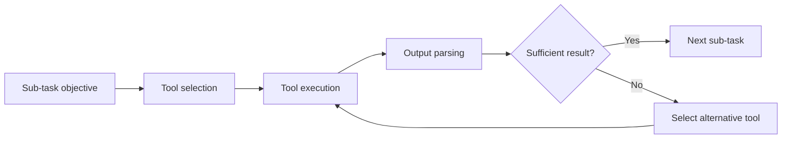

Cairn operates as an autonomous agent: given a goal, it reasons about what steps are needed, selects and executes the appropriate tools, interprets the results, and continues until the goal is achieved or a conclusion is reached. This page explains the architecture that makes this possible and how each component contributes to Cairn's autonomous operation.

## High-level architecture

Cairn is composed of three main layers that work together in a continuous loop.

<CardGroup cols={2}>
  <Card title="LLM reasoning core" icon="brain">
    A large language model that serves as the cognitive engine — interpreting context, making decisions, generating plans, and evaluating results
  </Card>
  <Card title="Task planner" icon="sitemap">
    Decomposes a high-level goal into an ordered sequence of concrete sub-tasks, each with a defined objective and expected output
  </Card>
  <Card title="Tool-use layer" icon="wrench">
    A structured interface between the LLM and external tools — scanners, exploit frameworks, search utilities, and custom scripts
  </Card>
  <Card title="Reflection and memory" icon="arrows-rotate">
    Tracks intermediate results, updates context between steps, and informs replanning when outcomes differ from expectations
  </Card>
</CardGroup>

## The agent loop

Cairn's execution follows a four-phase loop that repeats until the task is complete or a terminal state is reached.

<Steps>
  <Step title="Observe">
    Cairn ingests the current context: the original goal, any prior results, tool outputs from previous steps, and environmental signals. This observation phase builds the input the LLM will reason over.
  </Step>
  <Step title="Plan">
    The LLM reasoning core produces or updates a task plan — a structured sequence of sub-tasks. Each sub-task specifies what needs to be done, what tool or action should accomplish it, and what success looks like.
  </Step>
  <Step title="Act">
    Cairn executes the next sub-task by invoking the appropriate tool through the tool-use layer. Tools can include network scanners, web application testing utilities, exploit modules, shell commands, or external APIs.
  </Step>
  <Step title="Reflect">
    After execution, Cairn evaluates the output. Did the step succeed? Did it reveal new information? Does the overall plan need to change? The reflection output is fed back into the observation phase for the next loop iteration.
  </Step>
</Steps>

## Task decomposition

When given a high-level objective — for example, "assess the attack surface of this web application" — Cairn does not execute a fixed script. Instead, the task planner breaks the goal into sub-tasks dynamically based on context.

```text
Goal: Assess the attack surface of a target web application

Decomposed plan:
  1. Enumerate open ports and services on the target host
  2. Identify the web framework and server version
  3. Crawl the application to map endpoints and parameters
  4. Test identified endpoints for common vulnerability classes
  5. Attempt exploitation of confirmed vulnerabilities
  6. Summarize findings with severity ratings and evidence
```

Sub-tasks are not fixed at the start. As Cairn executes and receives new information, it can insert, reorder, or remove sub-tasks to reflect what it has learned.

## Tool selection and chaining

Within each sub-task, Cairn selects the most appropriate tool from its available set. Selection is driven by the sub-task objective, the current context, and the outputs of previous steps.



Tools are chained across sub-tasks: the structured output of one tool becomes the input context for the next. For example, a port scan result feeds into service enumeration, which feeds into targeted vulnerability testing.

## Replanning on failure

When a step produces an unexpected result — a tool fails, a target behaves differently than anticipated, or an exploit does not land — Cairn does not halt. The reflection phase detects the discrepancy and the planner generates a revised approach.

<AccordionGroup>
  <Accordion title="Tool failure" icon="triangle-exclamation">
    If a tool returns an error or unusable output, Cairn identifies an alternative tool or strategy for the same objective and retries before moving on.
  </Accordion>
  <Accordion title="Unexpected target behavior" icon="question">
    If the target responds in a way that invalidates assumptions in the current plan — for example, an endpoint returns a 403 rather than the expected response — Cairn updates its model of the target and adjusts subsequent steps.
  </Accordion>
  <Accordion title="Dead ends" icon="ban">
    If a line of investigation yields no actionable findings, Cairn marks that branch complete and refocuses on other sub-tasks, rather than repeatedly retrying a fruitless path.
  </Accordion>
</AccordionGroup>

<Info>
  Cairn's replanning is not random backtracking. The LLM reasons explicitly about why a step failed and what alternative approach is most likely to succeed given the observed evidence.
</Info>

## Reasoning traces

Every decision Cairn makes — which tool to use, why a result was interpreted a certain way, why the plan changed — is recorded as a reasoning trace alongside the tool output. This makes Cairn's behavior auditable and its conclusions explainable, which is essential for security engagements where evidence chains matter.

## Next steps

<CardGroup cols={2}>
  <Card title="Use cases" icon="list-check" href="/use-cases">
    See how the agent loop applies to specific security and automation scenarios
  </Card>
  <Card title="Core concepts" icon="lightbulb" href="/concepts/ai-agent">
    Dive deeper into Cairn's agent, task planning, and tool-use design
  </Card>
</CardGroup>
